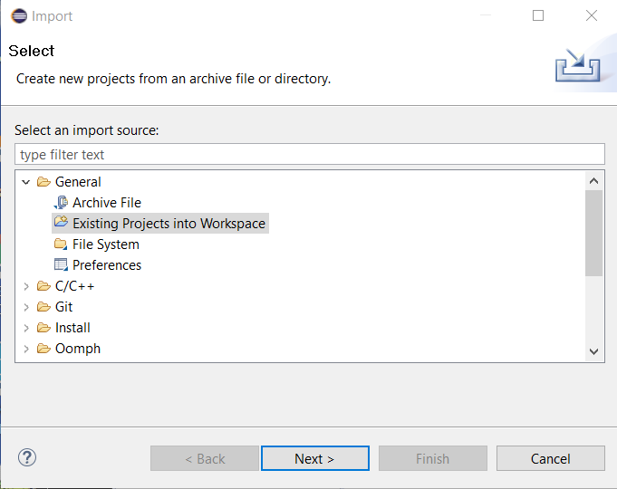
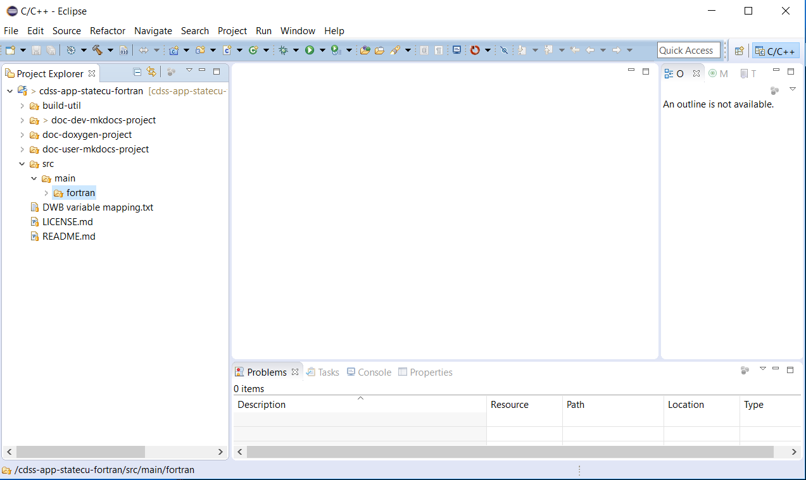

# New Developer Setup / Overview

This documentation is for software developers that are members of the core StateCU team and others who
have an interest in contributing to the StateCU software project.
It is recommended that the StateCU development environment should follow these setup instructions, which are
consistent with the [Development Environment](../dev-env/overview.md) and [Initial Project Setup](../project-init/overview.md) documentation.
The [standard development folder structure](../project-init/overview.md#development-folder-structure) should be followed to minimize potential for issues,
especially given the number of components and setup steps.
This documentation is consistent with the recommended development environment.

This documentation and development environment are also consistent with the StateMod software.
Configuring the development environment for StateCU will support compiling StateMod.

The intent of this documentation is to completely document setup steps and allow new developers to comment on this documentation
so that it can be improved for other developers. The following steps need to occur to set up a new developer's environment.
Links to other documentation are included to provide more information and **see details below** is used to indicate that
specific instructions are included below.
After reading instructions for a step, use "back" to return to this outline so that setup is done in the proper sequence.
**Bold comments** indicate which steps are required and which are optional.

The following sections are available in this page:

* [Minimal Development Environment Setup (for command line compiling)](#minimal-development-environment-setup-for-command-line-compiling)
* [Full Eclipse Development Environment Setup (for interactive development environment)](#full-eclipse-development-environment-setup-for-interactive-development-environment)
* Supporting Information (used in the above sections):
	+ [Create Folder for Development Files](#create-folder-for-development-files)
	+ [Clone Git Repositories](#clone-git-repositories)
	+ [Create Eclipse Workspace Folder](#create-eclipse-workspace-folder)
	+ [Import the Existing Eclipse StateCU Project from the Git Repository Folder](#import-the-existing-eclipse-statecu-project-from-the-git-repository-folder)

-----------------

## Minimal Development Environment Setup (for command line compiling)

A minimal development environment can be configured to develop and compile StateCU using
a text editor and command line compiler.

1. [Create folder for development files](#create-folder-for-development-files) - where development will occur - **required - see details below**
2. Development Environment software install part 1 (version control)
	* [Development Environment / Git](../dev-env/git.md) - install Git software so the repository can be cloned - **required if not already installed**
3. [Clone Git Repositories](#clone-git-repositories) - clone the repositories to get access to all files - **required - see details below**
4. Development Environment software install part 2 (documentation tools) - **optional, install if will view and edit documentation within development environment**
	* [Development Environment / Python and pip](../dev-env/python.md) - install Python, which is needed by MkDocs
	* [Development Environment / MkDocs](../dev-env/mkdocs.md) - install MkDocs to view/edit full documentation locally.
	See [Development Tasks / Documenting](../dev-tasks/documenting.md#developer-documentation-using-mkdocs)
	for instructions on viewing documentation.
5. Development Environment software install part 3 (Fortran development tools)
	* [Development Environment / Machine](../dev-env/machine.md) - configure machine for development - **required - to provide core environment**
	* [Development Environment / gfortran](../dev-env/gfortran.md) - install `gfortran` Fortran compiler - **required**
	* [Development Environment / Text Editor](../dev-env/text-editor.md) - install text editor of choice - **required, if not already done**
	* [Development Environment / Doxygen](../dev-env/doxygen.md) - install Doxygen to auto-generate code API documentation -
	**optional, install to auto-generate code API documentation and graphs from code and code comments**
	* [Development Environment / KDiff3](../dev-env/kdiff3.md) - install software to facilitate comparing files -
	**optional - highly useful and can be used with Git**
6. [Next Steps - Development Tasks](../dev-tasks/compiling.md) - compile software


## Full Eclipse Development Environment Setup (for interactive development environment) ##

Optionally, a full Eclipse development environment can be configured to develop and compile StateCU using
the Eclipse integrated development environment.

1. [Create folder for development files](#create-folder-for-development-files) - location for development files - **required - see details below**
2. Development Environment software install part 1 (version control)
	1. [Development Environment / Git](../dev-env/git.md) - install Git software so the repository can be cloned - **required, if not already installed**
3. [Clone Git Repositories](#clone-git-repositories) - clone the repositories to get access to all files - **required - see details below**
4. Development Environment software install part 2 (documentation tools) - **optional - install if will edit and view documentation**
	1. [Development Environment / Python and pip](../dev-env/python.md) - install Python, which is needed by MkDocs
	2. [Development Environment / MkDocs](../dev-env/mkdocs.md) - install MkDocs to view/edit full documentation locally.
	See [Development Tasks / Documenting](../dev-tasks/documenting.md#developer-documentation-using-mkdocs)
	for instructions on viewing documentation.
5. Development Environment software install part 3 (Fortran development tools)
	1. [Development Environment / Machine](../dev-env/machine.md) - configure machine for development - **required - to provide core environment**
	2. [Development Environment / Java 8](../dev-env/java8.md) - make sure Java 8 is available on system - **optional - not needed if text editor and command line compiler is used**
	3. [Development Environment / gfortran](../dev-env/gfortran.md) - install `gfortran` Fortran compiler - **required**
	4. [Development Environment / Eclipse and Photran](../dev-env/eclipse.md) - install Eclipse for use as IDE - **optional - not needed if text editor and command line compiler is used**
	5. [Development Environment / Doxygen](../dev-env/doxygen.md) - install Doxygen to auto-generate code API documentation -
	**optional - used by primary developers**
	6. [Development Environment / pytest](../dev-env/pytest.md) - install to facilitate automated testing (being evaluated) - **optional - may be used for testing**
	7. [Development Environment / KDiff3](../dev-env/kdiff3.md) - install software to facilitate comparing files - **optional - useful for file comparison**
6. Eclipse Workspace Setup (interactive development environment) - **optional - complete if Eclipse/Photran was installed in step 5d**
	1. [Create Eclipse Workspace Folder](#create-eclipse-workspace-folder) - simple manual step - **see details below**
	2. [Import the Existing Eclipse StateCU Project from the Git Repository Folder](#import-the-existing-eclipse-statecu-project-from-the-git-repository-folder) - import
	from Git repository working files - **see details below**
7. [Next Steps - Development Tasks](#next-steps-development-tasks) - compile software

-------------------

## Create Folder for Development Files

Create a development home folder consistent with the [initial project setup](../project-init/home-folder.md) - this
is an umbrella folder for all StateCU development files,
including software that is installed locally (as appropriate).
It is assumed that development will occur in a developer's home folder on the computer in order to provide separation from the
work of other developers on the computer.
Tools such as Git rely on a unique identity for developers in order to properly track edits to files.
After the folder is created, additional instructions will describe how to install development files into the folder.

### Linux

Do the following using a terminal window. Note that the syntax `~` indicates the home folder and is equivalent to the `$HOME` environment
variable location.

```bash
$ cd
$ mkdir cdss-dev
$ cd ~/cdss-dev/
$ mkdir StateCU
```

### Windows

Do the following in a Windows command shell, or perform the equivalent actions in file explorer.

```com
> C:
> cd \Users\userName
> mkdir cdss-dev
> cd cdss-dev
> mkdir StateCU
```

*Press back in the browser to return to the outline.*

## Clone Git Repositories

The [cdss-app-statecu-fortran Git repository hosted on GitHub](https://github.com/OpenCDSS/cdss-app-statecu-fortran)
contains the StateCU software and Git repository configuration files.
It also contains the most recent version of this documentation.
This is referred to as the main StateCU repository.

If using Eclipse/Photran, the repository will be imported into the Eclipse/Photran workspace as a Fortran project
in a later step, which allows the files to be managed in Git but also be accessed from Eclipse.

If prompted, specify the GitHub account credentials.
The repository will include the Fortran StateCU project.

The resulting files should match the [Development Folder Structure](../project-init/overview.md#development-folder-structure).

### Clone the repository files (Linux)

```bash
$ cd ~/cdss-dev/StateCU
$ mkdir git-repos
$ cd git-repos
$ git clone https://github.com/OpenCDSS/cdss-app-statecu-fortran.git
```

Once the main repository has been cloned, the `git-clone-all-statecu.sh` helper script will clone remaining repositories
including tests.

```bash
$ cd ~/cdss-dev/StateCU/git-repos/cdss-app-statecu-fortran/build-util
$ ./git-clone-all-statecu

### Clone the repository files (Windows)

Use the Linux instructions if using Git Bash.  The following will work if using Git Cmd.

```com
> C:
> cd \Users\user\cdss-dev\StateCU
> mkdir git-repos
> cd git-repos
> git clone https://github.com/OpenCDSS/cdss-app-statecu-fortran.git
```

*Press back in the browser to return to the outline.*

## Create Eclipse Workspace Folder

This step is the same as the [Initial Project Setup](../project-init/eclipse-workspace.md) so follow those instructions with the following input:

* Linux:  the workspace folder is `~/cdss-dev/StateCU/eclipse-workspace`
* Windows: the workspace folder is `C:\Users\user\cdss-dev\StateCU\eclipse-workspace`

Start Eclipse by running the [Eclipse run script](../project-init/eclipse-run-script.md) as shown below.
This script can be used any time to run Eclipse for this project.
If it is necessary to modify this script,
[see recommendations for a developer-specific run script](../project-init/eclipse-run-script.md#developer-specific-run-script).

Open the workspace in Eclipse in preparation of adding the code project from the Git repository in the next step.

### Linux

```bash
$ cd ~/cdss-dev/StateCU/git-repos/cdss-app-statecu-fortran/build-util/eclipse
$ ./run-eclipse-statecu.sh
```

### Windows

```bash
> C:
> cd \Users\user\cdss-dev\StateCU\git-repos\cdss-app-statecu-fortran\build-util\eclipse
> run-eclipse-statecu-mingw.bat
```

*Press back in the browser to return to the outline.*

## Import the Existing Eclipse StateCU Project from the Git Repository Folder

**This step should be created only if Eclipse/Photran are used.
If using a text editor with command line compiler, skip this step.**

The [Initial Project Setup](../project-init/overview.md) process performed by the software team leads
did extensive work to set up the Eclipse project 
and these files were saved to the Git repository as an Eclipse/Photran Fortran project.
This facilitates set-up by new developers.

New developers need to import the project into the empty workspace as follows.

Use ***File / Import*** and then follow the sequence below.



The first step allows browsing to an existing project (the user name will be different).


Press ***Finish*** in the initial import dialog.

The resulting Eclipse workspace is shown as below.
Note that Eclipse recognizes the associated Git repository indicated by the repository name/branch next to the Eclipse project.



## Next Steps - Development Tasks

At this point it should be possible to [compile and run StateCU](../dev-tasks/compiling.md) in Eclipse or on the command line.
See also:

* [Deployed Environment / Overview](../deployed-env/overview.md) - for an overview of the deployed software
* [Software Design / Overview](../software-design/overview.md) - to understand software structure and logic
* [Development Tasks / Overview](../dev-tasks/overview.md) - common development tasks
