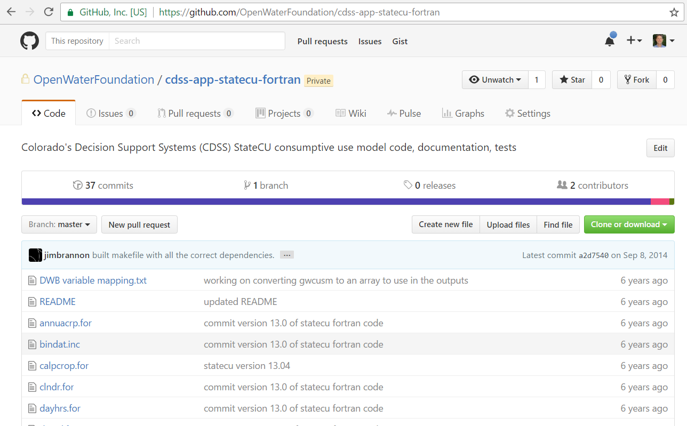
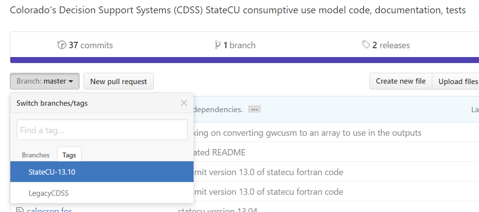

# Initial Project Setup / GitHub Git Repository

The initial StateCU code for OpenCDSS was originally loaded into a private GitHub repository maintained by Jim Brannon in 2011 and was never made public.
The repository had minimal structure and was mainly a home for the StateCU source code for a single developer.
The repository had a master branch but no other branches or tags.
The code in this repository was migrated to a new Open Water Foundation repository suitable for collaboration as part of the OpenCDSS effort.
The OWF repository was later migrated to the
[OpenCDSS account StateCU repository](https://github.com/OpenCDSS/cdss-app-statecu-fortran) using GitHub transfer tool.

The following resources are helpful:

* [Adding an existing project to GitHub using the command line](https://help.github.com/articles/adding-an-existing-project-to-github-using-the-command-line/)
* [Git Basics - Working with Remotes](https://git-scm.com/book/en/v2/Git-Basics-Working-with-Remotes)
* [Git Basics - Tagging](https://git-scm.com/book/en/v2/Git-Basics-Tagging)

This documentation contains the following sections:

* [Prerequisites](#prerequisites)
* [Create a New StateCU Repository on GitHub](#create-a-new-statecu-repository-on-github)
* [Clone Legacy GitHub StateCU Repository](#clone-legacy-github-statecu-repository)
* [Rename Legacy GitHub StateCU Repository](#rename-legacy-github-statecu-repository)
* [Change the Remote Git Repository to the New Empty GitHub Repository](#change-the-remote-git-repository-to-the-new-empty-github-repository)
* [Push the Legacy GitHub StateCU Repository to New GitHub Repository](#push-the-legacy-github-statecu-repository-to-new-github-repository)
* [Tag Repository as LegacyCDSS and 13.10](#tag-repository-as-legacycdss-and-statecu-1310)

--------------------

## Prerequisites

This step requires that the Git software was previously installed as per [Development Environment / Git](../dev-env/git.md) documentation.

## Create a New StateCU Repository on GitHub

The private repository [cdss-app-statecu-fortran](https://github.com/OpenWaterFoundation/cdss-app-statecu-fortran)
was created using the GitHub website and Open Water Foundation organization account.
This established an empty "remote" repository.
Following the above link will currently go to the OpenCDSS version of the repository.

## Clone Legacy GitHub StateCU Repository

Git Bash was used to create a local clone of Jim Brannon's original repository.

```
$ cd ~/cdss-dev/StateCU/git-repos
$ git clone https://github.com/jimbrannon/statecu-project.git

```

This copies the existing repository to the local computer with repository name `statecu-project`.

## Rename Legacy GitHub StateCU Repository

In order to align the legacy repository with the new GitHub repository, do a simple rename in Git Bash.
The OpenCDSS repository names follow a consistent naming convention, in this case indicating that
the software is part of CDSS, is an application (rather than a library, etc.), is called StateCU,
and is written in Fortran.

```
$ cd ~/cdss-dev/StateCU/git-repos
$ mv statecu-project cdss-app-statecu-fortran
```

## Change the Remote Git Repository to the New Empty GitHub Repository

The local repository that contains StateCU files needs to point to the new GitHub repository
so that changes are saved there, rather than the legacy GitHub repository.

First, list the current remote repositories:

```
$ cd ~/cdss-dev/StateCU/git-repos/cdss-app-statecu-fortran
$ git remote -v

origin  https://github.com/jimbrannon/statecu-project.git (fetch)
origin  https://github.com/jimbrannon/statecu-project.git (push)
```

Since a new remote origin needs to be added, remove the existing remote first:

```
$ git remote rm origin
$ git remote -v

(shows nothing)
```

Then add the new empty GitHub repository as a remote:

```
$ git remote add origin https://github.com/OpenWaterFoundation/cdss-app-statecu-fortran.git
$ git remote -v

origin  https://github.com/OpenWaterFoundation/cdss-app-statecu-fortran.git (fetch)
origin  https://github.com/OpenWaterFoundation/cdss-app-statecu-fortran.git (push)

```

## Push the Legacy GitHub StateCU Repository to New GitHub Repository

The local `cdss-app-statecu-fortran` repository now contains the contents of the legacy repository and
is associated with the new GitHub remote repository.
However, the GitHub repository is empty.  Push the local repository contents to the GitHub remote with:

```
$ git push origin master

Counting objects: 204, done.
Delta compression using up to 8 threads.
Compressing objects: 100% (98/98), done.
Writing objects: 100% (204/204), 289.09 KiB | 0 bytes/s, done.
Total 204 (delta 103), reused 204 (delta 103)
remote: Resolving deltas: 100% (103/103), done.
To https://github.com/OpenWaterFoundation/cdss-app-statecu-fortran.git
 * [new branch]      master -> master
```
A review of the files on GitHub shows that the `cdss-app-statecu-fortran` repository contains the original commits,
with date and committer information:



## Tag Repository as LegacyCDSS and StateCU-13.10

The repository is now ready to move forward with new modifications, including changes to be consistent with this documentation.
However, before making any changes, it is useful to tag the current version so that it is easy to check out the version later if necessary.
Create two annotated tags as follows and then push all the tags:

```
$ git tag -a LegacyCDSS -m "Version of StateCU code prior to starting OpenCDSS, same as StateCU-13.10 tag"
$ git tag -a StateCU-13.10 -m "StateCU version 13.10 code, same as LegacyCDSS tag"
$ git push origin --tags

Counting objects: 2, done.
Delta compression using up to 8 threads.
Compressing objects: 100% (2/2), done.
Writing objects: 100% (2/2), 396 bytes | 0 bytes/s, done.
Total 2 (delta 0), reused 0 (delta 0)
To https://github.com/OpenWaterFoundation/cdss-app-statecu-fortran.git
 * [new tag]         LegacyCDSS -> LegacyCDSS
  * [new tag]         StateCU-13.10 -> StateCU-13.10
```

Checking on the GitHub website verifies that the tags are available:



